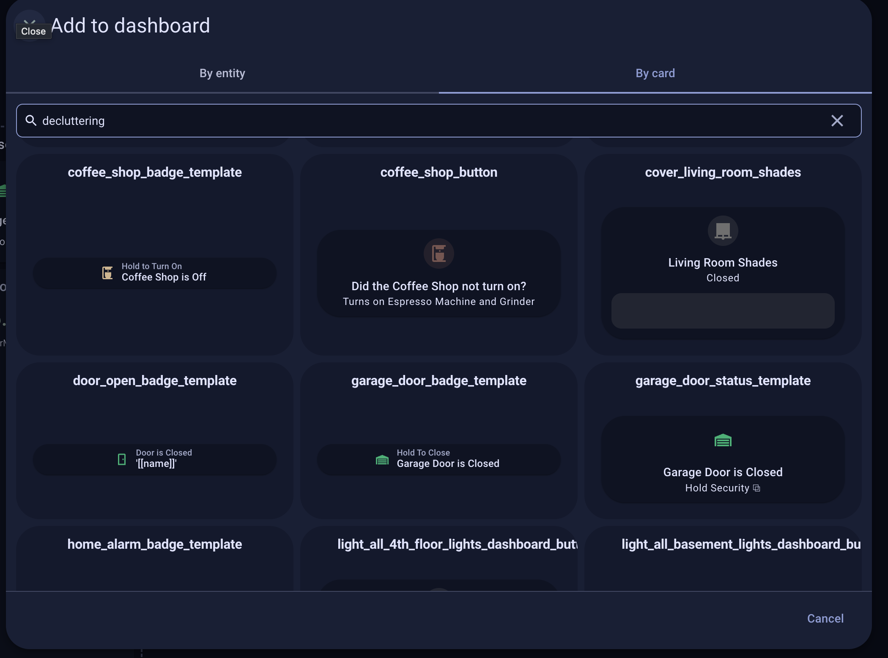
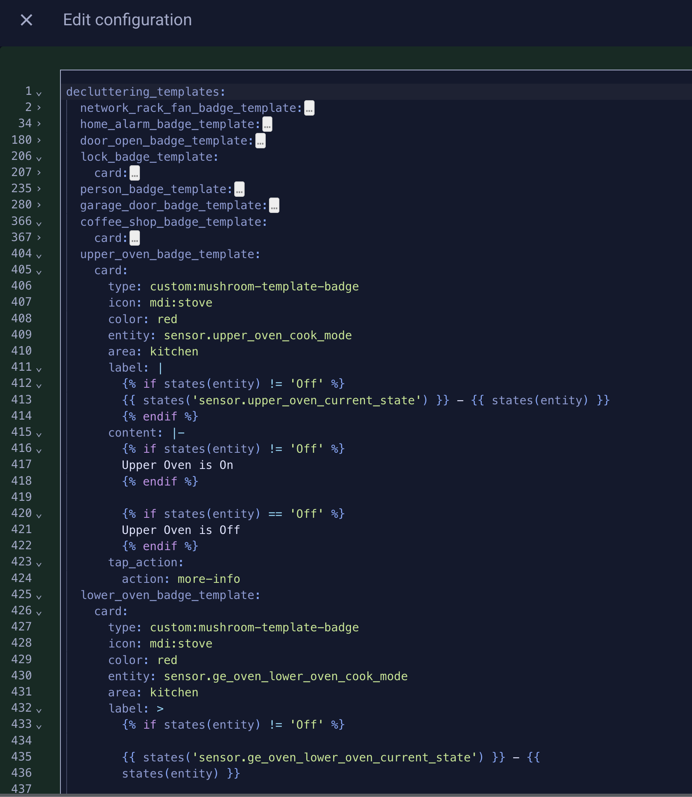
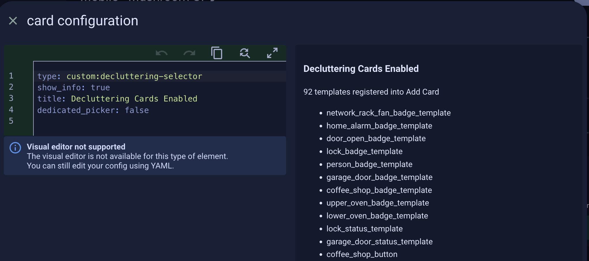

# Decluttering Selector

A Lovelace card for Home Assistant that **registers your
[`decluttering-card`](https://github.com/custom-cards/decluttering-card) templates
into Home Assistant's native "Add Card" picker** — so while you build a dashboard,
every template shows up as a selectable card with a live preview and inserts
pre-filled.



## The problem it solves

[`decluttering-card`](https://github.com/custom-cards/decluttering-card) lets you
define a template once (`decluttering_templates:` in your dashboard config) and reuse
it everywhere with different variables — but Home Assistant's native "Add Card" picker
has no idea those templates exist. To use one, you normally have to open the raw YAML
editor and hand-write a `type: custom:decluttering-card` block yourself, remembering
the template name and every variable it expects.

**Decluttering Selector** closes that gap: add it once to a dashboard, and every
template you've defined shows up as its own selectable card in the picker, with a
preview and a ready-to-go config — no YAML required.

## How it works

1. **Discovery** — on load, the card reads `decluttering_templates` off the current
   dashboard's Lovelace config (falling back to a `lovelace/config` websocket call if
   that config isn't attached to `hass` yet).
2. **Per-template registration** — for each template, it defines a small custom
   element with a `getStubConfig()` that returns a fully pre-filled
   `type: custom:decluttering-card` (template name + flattened default variables), and
   pushes an entry describing it into the global `window.customCards` array — the
   same public array every custom card (Mushroom, button-card, etc.) uses to register
   itself with HA's picker.
3. **Native picker integration** — Home Assistant's own "Add Card" dialog reads
   `window.customCards`, so your templates appear right alongside the built-in cards.
   Click one, and it inserts the exact pre-filled stub — no manual YAML.
4. **Staying in sync** — the card re-registers whenever the dashboard is saved
   (listening for the `lovelace_updated` event), so adding, renaming, or editing a
   template updates the picker without a page reload.

No forking of Home Assistant's frontend and no monkey-patching — only the same public
extension points every other custom card relies on (`window.customCards` +
`customElements`).

## What it does (v0.3.x)

- Reads `decluttering_templates` from the current dashboard
- Registers each template into the native Add Card picker (name, description, live preview)
- Clicking a template inserts a **pre-filled** `custom:decluttering-card`
- Re-registers on `lovelace_updated` (dashboard saved)
- Optional on-dashboard status list — a title, a count of templates registered, and
  the name of each one, for confirming at a glance that it found your templates.
  Hidden by default (see `show_info` below); this card's job is registering
  templates into the picker, not adding visible dashboard clutter

## Installation

### Option A — HACS (recommended)

[](https://my.home-assistant.io/redirect/hacs_repository/?owner=quincarter&repository=hass-decluttering-card-explorer&category=plugin)

1. Click the badge above (or, in HACS, go to **HACS → Frontend → ⋮ → Custom
   repositories** and add `https://github.com/quincarter/hass-decluttering-card-explorer`
   with category **Lovelace**).
2. Install **Decluttering Selector** from HACS.
3. HACS adds the module as a Lovelace resource automatically. If your dashboard is in
   **YAML mode**, add it yourself under **Settings → Dashboards → Resources**:

   ```yaml
   url: /hacsfiles/hass-decluttering-card-explorer/decluttering-selector.js
   type: module
   ```

4. Add the card to any dashboard that defines `decluttering_templates`:

   ```yaml
   type: custom:decluttering-selector
   ```

### Option B — Manual install

1. Download `dist/decluttering-selector.js` from the
   [latest release](https://github.com/quincarter/hass-decluttering-card-explorer/releases)
   (or build it yourself — see [CONTRIBUTING.md](.github/CONTRIBUTING.md)).
2. Copy it into your Home Assistant `config/www/` folder, e.g.
   `config/www/decluttering-selector.js`.
3. Add it as a Lovelace resource: **Settings → Dashboards → ⋮ → Resources → Add
   Resource**:

   ```yaml
   url: /local/decluttering-selector.js
   type: module
   ```

4. Add the card to any dashboard that defines `decluttering_templates`:

   ```yaml
   type: custom:decluttering-selector
   ```

5. Open **"Add Card"** on that dashboard — your templates now appear alongside the
   built-in cards, each with a live preview. Click one to insert a fully pre-filled
   `custom:decluttering-card`.

> [!WARNING]
> The real [`decluttering-card`](https://github.com/custom-cards/decluttering-card) resource must also be installed — the inserted stub references `type: custom:decluttering-card`, and your `decluttering_templates` already require it to work at all.

## Usage

### 1. Have some `decluttering_templates` defined

This card doesn't create templates — it surfaces ones that already exist. If you
don't have any yet, define them at the top level of your dashboard's config (works
in both storage mode and YAML mode):

```yaml
decluttering_templates:
  room-header:
    card:
      type: entities
      title: "[[title]]"
      entities:
        - "[[entity]]"
    default:
      - title: My Room
        entity: sensor.example
```

`[[title]]` and `[[entity]]` are placeholders — the `default:` block above supplies
the values Decluttering Selector will pre-fill when it registers this template.

A real dashboard usually has many of these — `decluttering_templates:` at the top,
sibling to `views:`:



### 2. Add the card to that same dashboard

The card only reads templates from the dashboard it's placed on (see
[Scope](#scope-current-dashboard-only) below), so add it there, once:

- **UI editor:** Edit Dashboard → **+ Add Card** → search for **"Decluttering
  Selector"** → Add.
- **YAML:**

  ```yaml
  type: custom:decluttering-selector
  ```

- Optional config:

  | Option      | Default  | Description                                               |
  | ----------- | -------- | --------------------------------------------------------- |
  | `title`     | _(none)_ | Heading shown above the status list, if `show_info` is on |
  | `show_info` | `false`  | Set `true` to show the on-dashboard status list           |

  ```yaml
  type: custom:decluttering-selector
  show_info: true
  title: My Templates
  ```

By default the card renders nothing visible on the dashboard — it's only there to
register templates into the picker (next step), and most people don't want a status
block cluttering up a real dashboard. Set `show_info: true` to see it: your optional
`title`, a line like "3 templates registered into Add Card", and a plain list of the
template names it found. Handy while confirming templates were picked up, or
debugging why one isn't showing in Add Card — see [Troubleshooting](#troubleshooting)
below.



> [!TIP]
> Even with `show_info` off, the card can still claim a cell in a grid/sections-based dashboard, since it's still a card, just an empty-looking one.
>
> If that bothers you, use Home Assistant's own per-card **Visibility** setting (the "Visibility" tab in the card editor) to hide it from everyone — that keeps it doing its job in the background without affecting your layout at all.

### 3. Open "Add Card" and pick a template

With the Decluttering Selector card present and loaded on the dashboard:

1. Edit the dashboard → **+ Add Card**.
2. Your templates now appear in the picker alongside the built-in cards, named after
   the template (e.g. **"room-header"**), each with a live preview.
3. Click one — it inserts a fully pre-filled `custom:decluttering-card` (with
   `template:` set to the template name and `variables:` set to its `default:`
   values), ready to use or tweak.
4. If a variable has no default in the template, it's inserted without a value —
   edit the card's YAML afterward to fill it in.

### Staying in sync

Adding, renaming, or editing a template and then **saving the dashboard** fires
Home Assistant's `lovelace_updated` event, which the card listens for and
re-registers against automatically — no manual reload needed for the _next_ time you
open Add Card.

One caveat: if the Add Card dialog is already **open** when you save a template
change, it won't live-refresh mid-session (Home Assistant loads the picker's card
list once, on open) — close and reopen it to see the update.

### Scope: current dashboard only

Only the dashboard the card is placed on is scanned. Templates defined on a
different dashboard won't show up here — add a copy of this card to each dashboard
whose templates you want in that dashboard's picker.

### Troubleshooting

Add `show_info: true` to the card's config first — the status line and template list
these steps refer to are hidden by default.

- **"0 templates registered" on the status line** — confirm `decluttering_templates`
  is actually defined at the top level of _this_ dashboard's config (not a different
  one), and check the browser console for a
  `decluttering-selector: failed to register templates` error, which points at the
  underlying failure.
- **Templates registered, but not showing in Add Card** — close and reopen the Add
  Card dialog (see [Staying in sync](#staying-in-sync) above).
- **Two templates collapse into one entry / one seems to disappear** — template
  names are sanitized into element-tag-safe names (lowercased, non-`[a-z0-9-]`
  characters collapsed to `-`); two names that only differ in case or punctuation
  (e.g. `My Card` vs `my-card`) can collide. Rename one to be more distinct.
- **Inserted card is missing a variable's value** — only variables present in the
  template's `default:` block get pre-filled; anything else needs to be filled in by
  hand after inserting.

## Contributing

Building, testing against a real HA instance, and cutting a release are covered in
[.github/CONTRIBUTING.md](.github/CONTRIBUTING.md).
